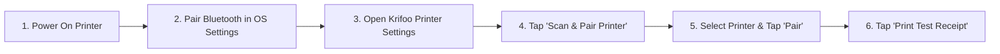

# Krifoo Admin POS & Thermal Receipt Printer Connection Manual

> **Production Setup Guide for Takeaway Owners & Restaurant Staff**  
> *Supports Epson TM-m30III, SUNMI, Star Micronics, Munbyn, RetailZ, and Universal ESC/POS Printers.*

---

## 📋 Overview of Supported Connection Modes

| Connection Mode | Best For | Cable Requirement | Network Required |
| :--- | :--- | :--- | :--- |
| **🔵 Bluetooth Wireless** *(Recommended)* | Fast setup, single counter POS | **Zero Cables** | ❌ No Wi-Fi required |
| **📶 WiFi / LAN IP** | Kitchen KOT printers, multi-tablet setups | Ethernet Cable or Router Wi-Fi | ✅ Same Local Network |
| **📱 Built-in Terminal** | SUNMI V3 MIX, SUNMI V2s, Flipdish | Built-in Hardware Engine | ❌ Direct Native SDK |
| **📄 System AirPrint** | Legacy iOS AirPrint & Android Print Spooler | AirPrint-enabled printer | ✅ Wi-Fi Network |

---

## 🔵 Method 1: Bluetooth Wireless Setup (Zero Cables — Recommended)

Follow these steps to connect your **Epson TM-m30III** (or any Bluetooth thermal printer) without needing an Ethernet cable or router:

### Step 1: Turn On Printer & Pair with OS
1. Turn **ON** your Epson TM-m30III thermal printer.
2. Open your iPad/iPhone or Android tablet **System Settings -> Bluetooth**.
3. Locate **TM-m30III** (or `EP-TM-M30III`) in available devices and tap to **Pair**.

### Step 2: Configure in Krifoo Admin App
1. Open **Krifoo Admin**.
2. Go to **Settings** -> tap **`Universal POS & Thermal Printing Setup`** (or go directly to `/printer-settings`).
3. Set **Printer Brand** to **`Epson ePOS (TM-m30III / TM-T88)`** *(RECOMMENDED)*.
4. Set **Connection Mode** to **`🔵 Bluetooth Wireless`**.

### Step 3: Use In-App Bluetooth Scanner
1. Tap the orange button: **`🔍 Scan & Pair Bluetooth Printer`**.
2. The **In-App Device Scanner Modal** will pop up and discover nearby Bluetooth printers.
3. Select your **Epson TM-m30III** from the list and tap **`Pair & Connect`**.

### Step 4: Hardware Test Print
1. Tap **`Print Test Receipt`**.
2. Your Epson TM-m30III printer will instantly output a sample receipt!

---

## 📶 Method 2: Wi-Fi / Local Network Setup (LAN IP)

Ideal for connecting kitchen thermal printers or sharing one printer across multiple staff tablets:

### Step 1: Connect Printer to Network & Find IP Address
1. Connect an Ethernet cable from your router to the printer (or configure Wi-Fi).
2. Hold down the **Feed Button** while turning on the printer to print a **Self-Test Slip**.
3. Note the printed **IP Address** (e.g., `192.168.1.100`).

### Step 2: Enter IP Details in Krifoo Admin
1. Open **Krifoo Admin** -> **Printer Settings** (`/printer-settings`).
2. Under **Connection Mode**, select **`📶 WiFi / LAN IP`**.
3. In the Network Settings box:
   - **Printer IP Address**: Enter `192.168.1.100` (your printer's IP).
   - **Port**: Enter `9100` (Standard RAW TCP Port) or `8008` (Epson ePOS XML Port).
4. Tap **Save**.

### Step 3: Test Connection
1. Tap **`Print Test Receipt`**.
2. Krifoo will send the receipt over your local network!

---

## 📱 Method 3: SUNMI & Built-in Hardware Setup

If you are operating a **SUNMI V3 MIX**, **SUNMI V2s**, or **Flipdish POS Terminal**:

1. Open **Krifoo Admin** -> **Printer Settings**.
2. Krifoo automatically detects the hardware engine and displays:  
   `Hardware Built-in Direct Native SDK Active`
3. No IP address or Bluetooth pairing is needed! Krifoo communicates directly with the built-in printer head.

---

## ⚙️ Receipt Layout & Automation Settings

| Setting | Options | Description |
| :--- | :--- | :--- |
| **Thermal Paper Roll Width** | `80mm` \| `58mm` | Choose `80mm` for standard wide POS receipts or `58mm` for compact receipts. |
| **Receipt Copies** | `1 Copy` \| `2 Copies` | Select `1 Copy` for counter receipts, or `2 Copies` (Customer + Kitchen KOT ticket). |
| **Automatic Paper Cut** | `ON` / `OFF` | Sends auto-cut signal (`\x1D\x56\x00`) to cut paper after printing. |
| **Auto-Print Live Orders** | `ON` / `OFF` | Automatically prints receipt when a customer places an order on your website or mobile app. |
| **Open Cash Drawer on Cash** | `ON` / `OFF` | Pulses cash drawer kickout code (`\x1B\x70\x00\x19\xFA`) when a cash payment order is placed. |

---

## 🛠️ Hardware Diagnostic & Troubleshooting Checklist

> [!TIP]
> **Issue: Printer not printing or connection error?**

1. **Verify Power & Paper Roll**:
   - Check if printer power light is green and thermal paper roll is facing correctly.
2. **Check Active Target**:
   - Open **Printer Settings** in Krifoo. Verify that **Active Target** shows `BT:EP-TM-M30III` (Bluetooth) or `192.168.1.100:9100` (Network).
3. **Run 1-Tap Diagnostic Test**:
   - Tap **`Print Test Receipt`** to verify communication.
   - Tap **`Kick Cash Drawer`** to test cash drawer pulse signal.
4. **Dual-Route Fallback Mechanism**:
   - Krifoo automatically attempts ePOS SOAP XML first (`http://ip:8008`).
   - If blocked by a router firewall, Krifoo automatically falls back to raw TCP socket stream (`ip:9100`) to guarantee delivery.
